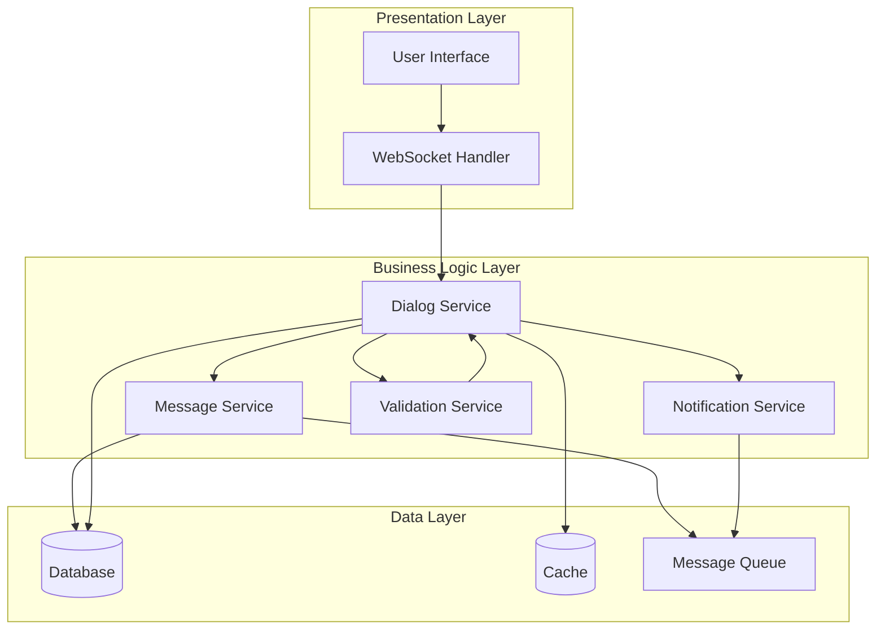
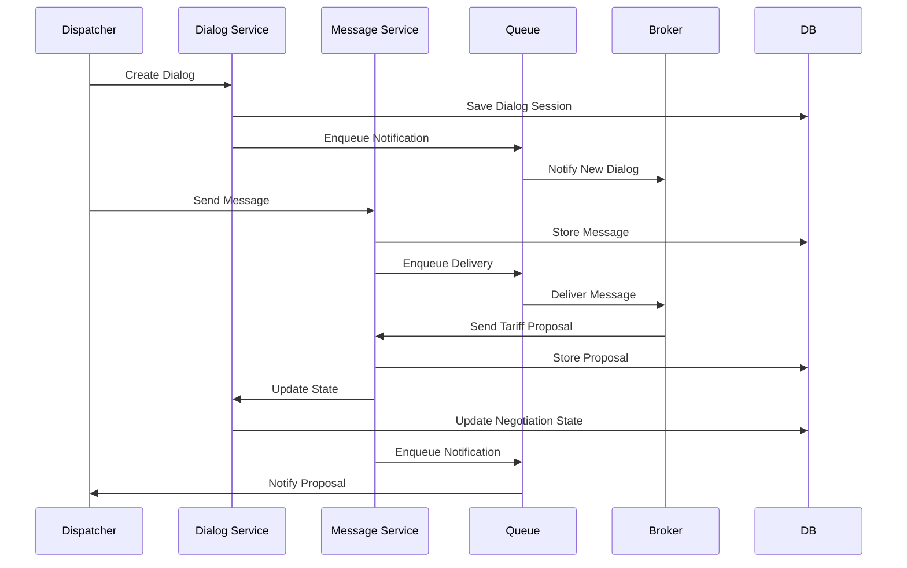

# Design Document: Dispatcher-Broker Dialog System

## Overview

Система диалога между Диспетчером и Брокером представляет собой платформу для структурированного взаимодействия участников логистического процесса. Система обеспечивает обмен сообщениями, передачу информации о грузах, предложение тарифов и согласование условий перевозки.

### Key Design Goals

- **Надёжность доставки сообщений**: Гарантированная доставка сообщений с сохранением порядка
- **Структурированность данных**: Валидация и типизация всех передаваемых данных
- **Отслеживаемость**: Полная история всех диалогов и изменений состояний
- **Производительность**: Быстрый поиск и доступ к историческим данным
- **Безопасность**: Защита от XSS-атак и валидация входных данных

## Architecture

### System Architecture

Система построена на основе трёхуровневой архитектуры:



### Communication Flow



## Components and Interfaces

### Dialog Service

Основной сервис управления диалогами и состояниями переговоров.

**Interface:**
```typescript
interface DialogService {
  // Создание нового диалога
  createDialog(dispatcherId: string, brokerId: string): Promise<DialogSession>
  
  // Получение диалога по ID
  getDialog(dialogId: string): Promise<DialogSession>
  
  // Обновление состояния переговоров
  updateNegotiationState(dialogId: string, state: NegotiationState): Promise<void>
  
  // Получение списка диалогов с фильтрацией
  listDialogs(userId: string, filters: DialogFilters): Promise<DialogSession[]>
  
  // Экспорт диалога
  exportDialog(dialogId: string, format: 'pdf' | 'json'): Promise<ExportResult>
}
```

### Message Service

Сервис обработки и доставки сообщений.

**Interface:**
```typescript
interface MessageService {
  // Отправка текстового сообщения
  sendMessage(dialogId: string, senderId: string, content: string): Promise<Message>
  
  // Отправка информации о грузе
  sendCargoInfo(dialogId: string, senderId: string, cargoInfo: CargoInfo): Promise<Message>
  
  // Отправка предложения тарифа
  sendTariffProposal(dialogId: string, senderId: string, proposal: TariffProposal): Promise<Message>
  
  // Получение истории сообщений
  getMessages(dialogId: string, pagination: Pagination): Promise<Message[]>
  
  // Пометка сообщений как прочитанных
  markAsRead(dialogId: string, userId: string): Promise<void>
}
```

### Validation Service

Сервис валидации входных данных.

**Interface:**
```typescript
interface ValidationService {
  // Валидация текстового сообщения
  validateMessage(content: string): ValidationResult
  
  // Валидация информации о грузе
  validateCargoInfo(cargoInfo: CargoInfo): ValidationResult
  
  // Валидация предложения тарифа
  validateTariffProposal(proposal: TariffProposal): ValidationResult
  
  // Санитизация текста
  sanitizeText(text: string): string
}
```

### Notification Service

Сервис управления уведомлениями.

**Interface:**
```typescript
interface NotificationService {
  // Отправка уведомления пользователю
  sendNotification(userId: string, notification: Notification): Promise<void>
  
  // Получение непрочитанных уведомлений
  getUnreadNotifications(userId: string): Promise<Notification[]>
  
  // Получение счётчика непрочитанных сообщений
  getUnreadCount(userId: string, dialogId: string): Promise<number>
}
```

### Search Service

Сервис поиска по диалогам.

**Interface:**
```typescript
interface SearchService {
  // Поиск по содержимому диалогов
  search(userId: string, query: SearchQuery): Promise<SearchResult[]>
  
  // Индексация нового сообщения
  indexMessage(message: Message): Promise<void>
}
```

## Data Models

### DialogSession

```typescript
interface DialogSession {
  id: string                          // Уникальный идентификатор диалога
  dispatcherId: string                // ID диспетчера
  brokerId: string                    // ID брокера
  negotiationState: NegotiationState  // Состояние переговоров
  createdAt: Date                     // Дата создания
  updatedAt: Date                     // Дата последнего обновления
  cargoInfo?: CargoInfo               // Информация о грузе
  finalAgreement?: TariffProposal     // Финальные условия сделки
}

type NegotiationState = 'initiated' | 'discussing' | 'agreed' | 'rejected'
```

### Message

```typescript
interface Message {
  id: string              // Уникальный идентификатор сообщения
  dialogId: string        // ID диалога
  senderId: string        // ID отправителя
  messageType: MessageType // Тип сообщения
  content: string         // Текстовое содержимое
  cargoInfo?: CargoInfo   // Информация о грузе (если применимо)
  tariffProposal?: TariffProposal // Предложение тарифа (если применимо)
  timestamp: Date         // Временная метка
  isRead: boolean         // Флаг прочтения
}

type MessageType = 'text' | 'cargo_info' | 'tariff_proposal' | 'acceptance' | 'rejection'
```

### CargoInfo

```typescript
interface CargoInfo {
  weight: number          // Вес груза в кг (положительное число)
  volume: number          // Объём груза в м³ (положительное число)
  cargoType: string       // Тип груза
  route: Route            // Маршрут перевозки
  specialRequirements?: string // Особые требования
}

interface Route {
  origin: Location        // Точка отправления
  destination: Location   // Точка назначения
  distance?: number       // Расстояние в км
}

interface Location {
  address: string         // Адрес
  coordinates?: {         // Координаты
    lat: number
    lon: number
  }
}
```

### TariffProposal

```typescript
interface TariffProposal {
  id: string              // Уникальный идентификатор предложения
  price: number           // Цена в рублях (положительное число)
  currency: string        // Валюта (по умолчанию RUB)
  deliveryTerms: DeliveryTerms // Условия доставки
  validUntil: Date        // Срок действия предложения
  additionalServices?: string[] // Дополнительные услуги
}

interface DeliveryTerms {
  estimatedDays: number   // Ожидаемое время доставки в днях
  pickupDate?: Date       // Дата забора груза
  deliveryDate?: Date     // Дата доставки
  insuranceIncluded: boolean // Включено ли страхование
}
```

### Notification

```typescript
interface Notification {
  id: string              // Уникальный идентификатор уведомления
  userId: string          // ID получателя
  dialogId: string        // ID связанного диалога
  notificationType: NotificationType // Тип уведомления
  content: string         // Содержимое уведомления
  timestamp: Date         // Временная метка
  isRead: boolean         // Флаг прочтения
}

type NotificationType = 'new_dialog' | 'new_message' | 'tariff_proposal' | 'negotiation_completed'
```

### Validation Models

```typescript
interface ValidationResult {
  isValid: boolean        // Результат валидации
  errors: ValidationError[] // Список ошибок
}

interface ValidationError {
  field: string           // Поле с ошибкой
  message: string         // Описание ошибки
  code: string            // Код ошибки
}
```

### Search Models

```typescript
interface SearchQuery {
  text?: string           // Текстовый запрос
  dateFrom?: Date         // Фильтр по дате (от)
  dateTo?: Date           // Фильтр по дате (до)
  participantId?: string  // Фильтр по участнику
  negotiationState?: NegotiationState // Фильтр по статусу
}

interface SearchResult {
  dialogId: string        // ID диалога
  messageId: string       // ID сообщения
  snippet: string         // Фрагмент с выделением
  timestamp: Date         // Дата сообщения
  participants: {         // Участники
    dispatcherId: string
    brokerId: string
  }
}
```


## Correctness Properties

*A property is a characteristic or behavior that should hold true across all valid executions of a system-essentially, a formal statement about what the system should do. Properties serve as the bridge between human-readable specifications and machine-verifiable correctness guarantees.*

### Property 1: Dialog Creation Round-Trip

*For any* dispatcher ID and broker ID, creating a dialog should result in a dialog session with a unique ID that, when retrieved, contains the same participant information.

**Validates: Requirements 1.1, 1.3**

### Property 2: Initial State Invariant

*For any* newly created dialog, the negotiation state must always be "initiated".

**Validates: Requirements 1.2**

### Property 3: Event Notification Consistency

*For any* dialog creation or message event, the system should create appropriate notifications for the relevant participants (broker for new dialogs, recipient for new messages).

**Validates: Requirements 1.4, 7.1**

### Property 4: Message Persistence Round-Trip

*For any* message sent to a dialog, retrieving that message should return the same content with correct sender ID and timestamp metadata.

**Validates: Requirements 2.1**

### Property 5: Message Ordering Invariant

*For any* sequence of messages sent to a dialog, retrieving the message history should return them in the same chronological order they were sent.

**Validates: Requirements 2.3, 2.4**

### Property 6: Cargo Info Validation

*For any* cargo info missing required fields (weight, volume, or route), the validation should reject it and return an error.

**Validates: Requirements 3.1**

### Property 7: Validation Error Format

*For any* invalid data submitted to the system, the validation error should contain specific information about which fields are problematic and why.

**Validates: Requirements 3.2, 8.2**

### Property 8: Cargo Info Persistence Round-Trip

*For any* valid cargo info saved to a dialog session, retrieving that dialog should return the same cargo info with all fields intact.

**Validates: Requirements 3.3**

### Property 9: Tariff Proposal Validation

*For any* tariff proposal missing required fields (price or delivery terms), the validation should reject it and return an error.

**Validates: Requirements 4.1**

### Property 10: Tariff-Cargo Association

*For any* tariff proposal sent in a dialog, the proposal should be correctly associated with the cargo info in that dialog session.

**Validates: Requirements 4.2**

### Property 11: State Transition on Proposal

*For any* dialog in "initiated" state, sending a tariff proposal should transition the negotiation state to "discussing".

**Validates: Requirements 4.3**

### Property 12: State Transition on Acceptance

*For any* dialog with a tariff proposal, when the dispatcher accepts it, the negotiation state should transition to "agreed".

**Validates: Requirements 5.1**

### Property 13: State Transition on Rejection

*For any* dialog with a tariff proposal, when the dispatcher rejects it, the negotiation state should transition to "rejected".

**Validates: Requirements 5.2**

### Property 14: Final State Immutability

*For any* dialog in "agreed" or "rejected" state, attempts to send new tariff proposals should be rejected by the system.

**Validates: Requirements 5.3**

### Property 15: Completion Notification

*For any* dialog that transitions to "agreed" or "rejected" state, both participants (dispatcher and broker) should receive completion notifications.

**Validates: Requirements 5.4**

### Property 16: Final Agreement Persistence

*For any* dialog where a tariff proposal is accepted, the final agreement should be saved in the dialog session and retrievable.

**Validates: Requirements 5.5**

### Property 17: Dialog Filtering Correctness

*For any* set of dialogs and filter criteria (date range, status, participant), the filtered results should only include dialogs that match all specified criteria.

**Validates: Requirements 6.2, 9.4**

### Property 18: Dialog List Completeness

*For any* dialog in the list results, the returned data should include all required fields: date, participants, status, and cargo info.

**Validates: Requirements 6.3**

### Property 19: Message History Completeness

*For any* dialog with messages, retrieving the full dialog should return all messages that were sent to it.

**Validates: Requirements 6.4**

### Property 20: Offline Notification Persistence

*For any* notification created for an offline user, the notification should be persisted and retrievable when the user comes online.

**Validates: Requirements 7.2**

### Property 21: Unread Counter Accuracy

*For any* dialog, the unread message count should equal the number of messages in that dialog marked as unread for the requesting user.

**Validates: Requirements 7.3**

### Property 22: Mark as Read Idempotence

*For any* dialog, opening it should mark all messages as read, and opening it again should maintain that state (idempotent operation).

**Validates: Requirements 7.4**

### Property 23: Type Validation

*For any* data submitted with incorrect types (e.g., string instead of number), the validation should reject it with a type error.

**Validates: Requirements 8.1**

### Property 24: XSS Sanitization

*For any* text message containing potentially dangerous HTML/script tags, the sanitized version should have those tags escaped or removed.

**Validates: Requirements 8.3**

### Property 25: Search Result Accuracy

*For any* search query text, all returned results should contain the search text either in message content or cargo info fields.

**Validates: Requirements 9.1**

### Property 26: Search Result Highlighting

*For any* search result, the snippet field should contain the matched text from the original message or cargo info.

**Validates: Requirements 9.3**

### Property 27: Export Format Validity

*For any* dialog export request with specified format (PDF or JSON), the generated export should be a valid document in that format.

**Validates: Requirements 10.1**

### Property 28: Export Completeness

*For any* exported dialog, the export should contain all messages, cargo info, tariff proposals, and metadata (creation date, participants, status).

**Validates: Requirements 10.2, 10.3**

### Property 29: Export Result Availability

*For any* completed export operation, the result should include a valid download link or file reference.

**Validates: Requirements 10.4**

## Error Handling

### Error Categories

**Validation Errors (400)**
- Missing required fields
- Invalid data types
- Out-of-range values
- Invalid format

**Authorization Errors (403)**
- User not participant in dialog
- Insufficient permissions for operation

**Not Found Errors (404)**
- Dialog not found
- Message not found
- User not found

**Conflict Errors (409)**
- Dialog already in final state
- Duplicate operation attempt

**Server Errors (500)**
- Database connection failure
- Message queue unavailable
- External service failure

### Error Response Format

```typescript
interface ErrorResponse {
  error: {
    code: string              // Machine-readable error code
    message: string           // Human-readable error message
    details?: ValidationError[] // Additional error details
    timestamp: Date           // When error occurred
    requestId: string         // For tracking and debugging
  }
}
```

### Error Handling Strategy

**Validation Errors:**
- Validate all input at service boundaries
- Return detailed error messages with field-level information
- Sanitize all text inputs before processing
- Reject requests early to prevent invalid state

**Transient Errors:**
- Implement retry logic for message delivery (3 attempts with exponential backoff)
- Use message queue for reliable notification delivery
- Cache frequently accessed data to reduce database load

**Data Consistency:**
- Use database transactions for multi-step operations
- Implement optimistic locking for concurrent updates
- Maintain audit log for all state changes

**Graceful Degradation:**
- If search service unavailable, return basic filtering results
- If notification service down, queue notifications for later delivery
- If export service slow, provide async export with email notification

## Testing Strategy

### Unit Testing

Unit tests will focus on specific examples, edge cases, and error conditions:

**Validation Logic:**
- Test specific invalid inputs (empty strings, negative numbers, missing fields)
- Test boundary conditions (message length exactly 5000 characters)
- Test XSS sanitization with known attack vectors

**State Transitions:**
- Test specific state transition sequences
- Test invalid state transitions are rejected
- Test edge cases (e.g., accepting already rejected proposal)

**Business Logic:**
- Test specific dialog creation scenarios
- Test message ordering with known sequences
- Test notification creation for specific events

**Integration Points:**
- Test database operations with test data
- Test message queue integration
- Test external service mocking

### Property-Based Testing

Property-based tests will verify universal properties across all inputs using a PBT library (e.g., fast-check for TypeScript/JavaScript, Hypothesis for Python, or QuickCheck for Haskell).

**Configuration:**
- Minimum 100 iterations per property test
- Each test tagged with format: **Feature: dispatcher-broker-dialog, Property {number}: {property_text}**

**Test Generators:**

```typescript
// Example generators for property-based testing
const arbitraryUserId = fc.uuid()
const arbitraryDialogId = fc.uuid()

const arbitraryCargoInfo = fc.record({
  weight: fc.double({ min: 0.1, max: 100000 }),
  volume: fc.double({ min: 0.1, max: 1000 }),
  cargoType: fc.string({ minLength: 1, maxLength: 100 }),
  route: fc.record({
    origin: fc.record({
      address: fc.string({ minLength: 5, maxLength: 200 })
    }),
    destination: fc.record({
      address: fc.string({ minLength: 5, maxLength: 200 })
    })
  })
})

const arbitraryTariffProposal = fc.record({
  price: fc.double({ min: 100, max: 1000000 }),
  currency: fc.constant('RUB'),
  deliveryTerms: fc.record({
    estimatedDays: fc.integer({ min: 1, max: 90 }),
    insuranceIncluded: fc.boolean()
  }),
  validUntil: fc.date({ min: new Date() })
})

const arbitraryMessage = fc.record({
  content: fc.string({ minLength: 1, maxLength: 5000 }),
  senderId: arbitraryUserId
})
```

**Property Test Examples:**

```typescript
// Property 1: Dialog Creation Round-Trip
test('Feature: dispatcher-broker-dialog, Property 1: Dialog creation round-trip', () => {
  fc.assert(
    fc.property(arbitraryUserId, arbitraryUserId, async (dispatcherId, brokerId) => {
      const dialog = await dialogService.createDialog(dispatcherId, brokerId)
      const retrieved = await dialogService.getDialog(dialog.id)
      
      expect(retrieved.dispatcherId).toBe(dispatcherId)
      expect(retrieved.brokerId).toBe(brokerId)
      expect(retrieved.id).toBe(dialog.id)
    }),
    { numRuns: 100 }
  )
})

// Property 5: Message Ordering Invariant
test('Feature: dispatcher-broker-dialog, Property 5: Message ordering invariant', () => {
  fc.assert(
    fc.property(
      arbitraryDialogId,
      fc.array(arbitraryMessage, { minLength: 2, maxLength: 20 }),
      async (dialogId, messages) => {
        // Send messages in sequence
        const sentIds = []
        for (const msg of messages) {
          const sent = await messageService.sendMessage(dialogId, msg.senderId, msg.content)
          sentIds.push(sent.id)
        }
        
        // Retrieve messages
        const retrieved = await messageService.getMessages(dialogId, { limit: 100 })
        const retrievedIds = retrieved.map(m => m.id)
        
        // Order should be preserved
        expect(retrievedIds).toEqual(sentIds)
      }
    ),
    { numRuns: 100 }
  )
})

// Property 14: Final State Immutability
test('Feature: dispatcher-broker-dialog, Property 14: Final state immutability', () => {
  fc.assert(
    fc.property(
      arbitraryDialogId,
      fc.constantFrom('agreed', 'rejected'),
      arbitraryTariffProposal,
      async (dialogId, finalState, newProposal) => {
        // Setup: dialog in final state
        await dialogService.updateNegotiationState(dialogId, finalState)
        
        // Attempt to send new proposal should fail
        await expect(
          messageService.sendTariffProposal(dialogId, 'brokerId', newProposal)
        ).rejects.toThrow()
      }
    ),
    { numRuns: 100 }
  )
})
```

**Coverage Goals:**
- All 29 correctness properties implemented as property-based tests
- Unit tests for edge cases and specific error scenarios
- Integration tests for end-to-end workflows
- Minimum 80% code coverage overall

### Test Data Management

**Test Database:**
- Use in-memory database for unit tests (e.g., SQLite in-memory)
- Use Docker containers for integration tests
- Reset database state between test runs

**Test Fixtures:**
- Create reusable fixtures for common scenarios
- Use factories for generating test data
- Maintain separate test data sets for different test suites

### Performance Testing

While not part of property-based testing, performance requirements should be validated:
- Message delivery latency (< 1 second)
- Search response time (< 2 seconds)
- Load testing for concurrent users
- Database query optimization validation

